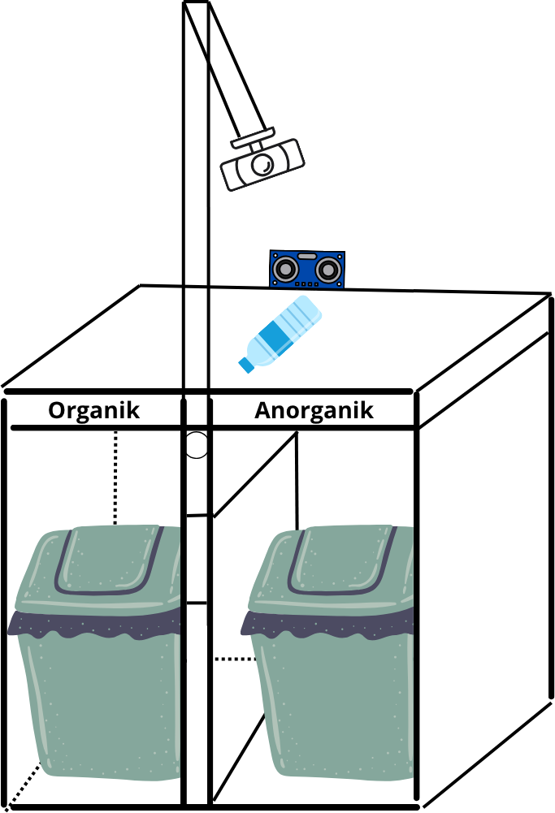

# Waste Classification System – MobileNetV2 + Raspberry Pi

## 📌 Description
This project is an **automatic waste classification and sorting system** based on Raspberry Pi 4, using a **MobileNetV2** deep learning model in **TensorFlow Lite** format to detect and classify waste into two categories:
- **Organic**
- **Inorganic**

The system integrates a **camera** for image capture, **ultrasonic sensor** for object detection, and a **servo motor** to open/close the bin according to the detected waste type.

---

## 📦 Equipment & Materials
- 🖥 **Raspberry Pi 4** (recommended 4GB RAM or higher)
- 📷 **Logitech C270 HD Camera** (or another compatible USB camera)
- 📏 **Ultrasonic Sensor HC-SR04**
- ⚙ **Servo Motor** (e.g., SG90 or MG996R)
- 📦 **MicroSD Card** (minimum 16GB)
- 🔌 **Raspberry Pi Power Supply** (5V 3A)
- 🔌 Jumper wires, breadboard, and connectors
- 🗑 Prototype waste bin

---


> **Note:** `tflite-runtime` is **not** included in `requirements.txt` because it must be installed manually based on your Raspberry Pi architecture and Python version.

---


## 🗑 Design & Prototyping

The prototype of this smart waste bin is designed with **two compartments** for:
- **Organic Waste** (left side)
- **Inorganic Waste** (right side)

This is the prototype design of the smart waste bin system:

<p align="center">
  
</p>

The system integrates:
- **Camera** mounted above the waste inlet to capture the object image.
- **Ultrasonic Sensor** placed at the inlet to detect object presence within 15 cm.
- **Servo Motor** positioned inside the bin’s divider to direct waste into the correct compartment.

---

## 🛠 Installation

### 1️⃣ Update & Install Basic Dependencies
```bash
sudo apt update && sudo apt upgrade -y
sudo apt install python3-pip python3-dev libatlas-base-dev libjasper-dev libqtgui4 libqt4-test -y
```

### 2️⃣ Clone The Repositories
```bash
git clone https://github.com/USERNAME/waste-classification-mobilenetv2-raspberrypi.git
cd waste-classification-mobilenetv2-raspberrypi
```

### 3️⃣ Install All Python Dependencies from requirements.txt
```bash
pip3 install -r requirements.txt
```

### 4️⃣ Install TensorFlow Lite Runtime
Check Python version:
```bash
python3 --version
```
Download and install the correct wheel file:
```bash
# Example for Raspberry Pi 64-bit, Python 3.9
wget https://github.com/google-coral/pycoral/releases/download/release-frogfish/tflite_runtime-2.14.0-cp39-cp39-linux_aarch64.whl
pip3 install tflite_runtime-2.14.0-cp39-cp39-linux_aarch64.whl
```

## 🚀 Running the Program
1. Connect all components (camera, sensor, servo) as configured in the script.
2. Run:
```bash
python3 project.py
```
3. Open your browser and go to:
```bash
http://<RASPBERRY_PI_IP>:5000
```

## 📂 Folder Structure
```bash
waste-classification-mobilenetv2-raspberrypi/
│
├── project.py              # Main Flask + classification script
├── model_smartwaste.tflite # MobileNetV2 TFLite model
├── labels.txt              # Classification labels
├── requirements.txt        # Python dependencies
└── README.md               # Project documentation
```

## 🛠 Troubleshooting
- Camera not detected → Check with ls /dev/video*.
- Servo not moving → Verify GPIO pin mapping and ensure sufficient power supply.
- tflite_runtime errors → Download the correct .whl file for your Pi.

## 📜 License
This project is open-source and can be modified for personal or research purposes.

## Developed by IEVAN BRYAN – 2025
